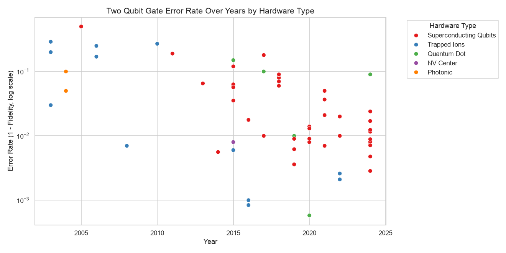

# Qubit Hardware Database

A database of quantum computing hardware performance, pulled by hand from published papers. 101 papers, 2000 to 2024, six hardware platforms.

|  |
|:--:|
| *Two-qubit gate error rate (1 - fidelity), 62 reported measurements across 5 platforms. More plots in `Qubit_Database.ipynb`.* |

## Overview

The Qubit Hardware Database is a research project that collects and organizes data on quantum computing hardware from published research papers. The database tracks key performance metrics such as:

- Coherence times (T1, T2)
- Gate fidelities (single and two-qubit)
- Error rates (measurement, state preparation, SPAM)
- Gate operation times
- Qubit counts
- Operating temperatures

This repository provides tools to access, visualize, and analyze trends in quantum computing hardware development across different architectures (superconducting, trapped ion, photonic, etc.) and years.

## Data Source

The database is populated from a [Google Sheet](https://docs.google.com/spreadsheets/d/158mz7xAjDFkdbqp3O21ImE8iuDVOflKmgsl9-1Y5QcE/edit?gid=0#gid=0) that contains manually entered data from research papers. Each entry includes:

- DOI (Digital Object Identifier) of the paper
- Hardware type
- Year of publication
- Number of qubits
- Performance metrics
- Summary of the work
- Additional notes

## Running the notebook

Python 3, with `pandas`, `numpy`, `matplotlib`, `seaborn`, `sqlite3` and `plotly`. Last checked
against Python 3.13 and pandas 3.0.

**The first code cell deletes `qubit_data.db` and rebuilds it from the Google Sheet.** If you only
want to query or plot the data that is already committed here, skip that cell and start from the
"Example Plots" section.

## Using the Database

### Database Structure

The database contains:
1. A main table with basic information about each paper
2. Normalized tables for specific metrics:
   - T1_Times
   - T2_Times
   - Single_Qubit_Fidelity
   - Two_Qubit_Fidelity
   - Measurement_Error
   - State_Prep_Error
   - SPAM_Error
   - Single_Qubit_Gate_time
   - Two_Qubit_Gate_time

### Accessing Data

```python
import sqlite3
import pandas as pd

# Connect to the database
conn = sqlite3.connect('qubit_data.db')

# Simple query to get all data from main table
main_df = pd.read_sql_query("SELECT * FROM main", conn)

# Query specific metrics
t1_data = pd.read_sql_query("SELECT * FROM T1_Times", conn)

# Join metrics with main table information
query = """
SELECT m.DOI, m.Hardware_Type, m.Year, m.Number_of_Qubits,
       t.Value, t.Uncertainty
FROM T1_Times t
JOIN main m ON t.DOI = m.DOI
"""
combined_data = pd.read_sql_query(query, conn)

# Always close the connection when done
conn.close()
```

### Creating Visualizations

#### Basic Time Series Plots

```python
import matplotlib.pyplot as plt
import seaborn as sns
import sqlite3
import pandas as pd

# Connect to the database
conn = sqlite3.connect('qubit_data.db')

# Load data with joins
def load_table_data(table_name):
    query = f"""
    SELECT m.DOI, m.Hardware_Type, m.Year, m.Number_of_Qubits,
           t.Value, t.Uncertainty
    FROM {table_name} t
    JOIN main m ON t.DOI = m.DOI
    """
    return pd.read_sql_query(query, conn)

# Example: Plot T1 Times vs Year
df = load_table_data('T1_Times')
df['Year'] = pd.to_numeric(df['Year'], errors='coerce')
df = df.dropna(subset=['Year', 'Value'])

plt.figure(figsize=(12, 6))
sns.scatterplot(
    data=df,
    x='Year',
    y='Value',
    hue='Hardware_Type',
    s=50,
    alpha=0.8
)
plt.yscale('log')
plt.title('T1 Coherence Times Over Years by Hardware Type')
plt.xlabel('Year')
plt.ylabel('T1 Time (ms, log scale)')
plt.legend(title='Hardware Type', bbox_to_anchor=(1.05, 1), loc='upper left')
plt.tight_layout()
plt.show()

conn.close()
```

The repository includes examples of various visualizations you can create, all included in `Qubit_Database.ipynb`.

## Contributing

You can add new datapoints to this [Google Sheet](https://docs.google.com/spreadsheets/d/158mz7xAjDFkdbqp3O21ImE8iuDVOflKmgsl9-1Y5QcE/edit?gid=0#gid=0). Here is how new data should be entered:
1. For the normalized data columns, if there are multiple entries separate them by a ";" character.
2. If there is an uncertainty on a measurement add a ":" character (e.g. `value:uncertainty; value:uncertainty`)
3. For the name of the Hardware type try and keep it the same format as the other names in the previous columns

## Future Enhancements

Potential improvements for this project include:

1. **LLM-Based Query Interface**
   - Create a Large Language Model that uses this database to answer specific questions
  
2. **Web Interface**
   - Create a web-based dashboard for exploring the data
   - Implement interactive visualizations with filters

3. **Automated Data Collection**
   - Develop scripts to scrape papers for relevant metrics
   - Implement natural language processing to extract quantum hardware details

4. **Extended Database Schema**
   - Add more metrics (e.g., quantum volume, circuit depth capabilities)
   - Track more details about architecture (e.g., connectivity, control systems)
